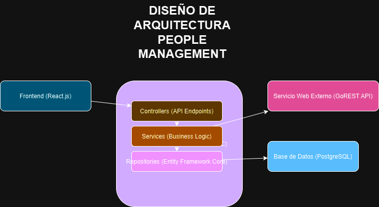
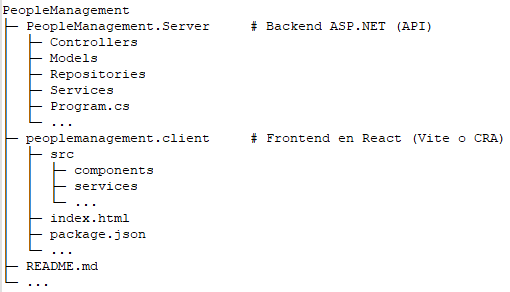

# udla-people-management-jm

# People Management

Aplicación **web** para la **gestión de personas** (CRUD), con integración a un **servicio externo** (GoRest) y una **interfaz moderna(React BootStrap)** desarrollada en **React**. Utiliza **.NET /8+** como backend (API) y **Entity Framework Core** para la capa de acceso a datos.

## Tabla de Contenidos
1. [Características Principales](#características-principales)
2. [Requerimientos Previos](#requerimientos-previos)
3. [Estructura del Proyecto](#estructura-del-proyecto)
4. [Configuraciones](#configuraciones)
5. [Dependencias Principales](#dependencias-principales)
6. [Guía de Ejecución (Desarrollo)](#guía-de-ejecución-desarrollo)
7. [Despliegue en Producción](#despliegue-en-producción)
8. [Validaciones y Seguridad](#validaciones-y-seguridad)
9. [Pruebas Unitarias](#pruebas-unitarias)
10. [Contactos y Créditos](#contactos-y-créditos)

---

## Características Principales

- **CRUD para gestionar Personas**:  
  - Crear, listar, actualizar y eliminar registros de personas (nombre, correo, edad, género.).  
- **Filtrado y Paginación**:  
  - Filtros por nombre, correo, edad, género.  
  - Paginación tanto en la lista de personas como en el consumo del servicio GoRest.  
- **Consumo de Servicio Externo (GoRest)**:  
  - Obtiene usuarios de la API `https://gorest.co.in/public/v2/users` con manejo de paginación.  
- **Validaciones**:  
  - Correo con `@` en el front y `[EmailAddress]` en el backend.  
  - Edad en rango [1..120].  
  - Género con lista desplegable.  
- **Notificaciones con Toast**:  
  - Éxitos, advertencias y errores.  
- **Arquitectura** en capas:  
  - `Api/Controllers` (Presentación)  
  - `Services` (lógica de negocio)  
  - `Repositories` (acceso a datos)  
  - `Models/Entities` (entidades del dominio)

---

## Requerimientos Previos

1. **.NET SDK** (v8.0 o superior).
2. **Node.js** (v14 o superior) y **npm** (o **yarn**) para el frontend en React.
3. **Visual Studio 2022** o **Visual Studio Code** para compilar.
4. **Base de datos** (SQL Server o PostgreSQL) si se requiere persistencia local.
5. **Navegador** moderno (Chrome, Edge, Firefox).

---
## Arquitectura del Proyecto



## Estructura del Proyecto




- **PeopleManagement.Server**: Proyecto .NET con la API REST, controladores `PersonsController.cs` y `GoRestController.cs`, capa de servicios (`PersonService`, `GoRestService`), etc.


- **peoplemanagement.client**: Proyecto React con los componentes (`PersonList`, `GoRestList`, `PersonFormModal`, etc.), servicios de fetch/axios (`personService.ts`, `goRestService.ts`) y la configuración de rutas.  

---

## Configuraciones

1. **Cadena de Conexión** (base de datos local):
   - En `appsettings.json` del proyecto `PeopleManagement.Server`:
     ```json
     {
       "ConnectionStrings": {
         "DefaultConnection": "Server=localhost;Database=PeopleDB;User Id=sa;Password=TuPassword;Encrypt=True;TrustServerCertificate=True;"
       }
     }
     ```
   - Ajustar para **PostgreSQL** o **SQL Server** según el entorno, en el proyecto se ha usado PostgreSQL.

---

## Dependencias Principales

### Backend (PeopleManagement.Server)

- **Microsoft.EntityFrameworkCore** (acceso a datos con EF Core).  
- **Microsoft.EntityFrameworkCore.SqlServer** (o `Npgsql` si PostgreSQL).  
- **Swashbuckle.AspNetCore** (opcional para Swagger).  
 

### Frontend (peoplemanagement.client)

- **React** + **TypeScript**  
- **React Router DOM** (ruteo).  
- **React-Bootstrap** (UI responsiva).  
- **React Toastify** (notificaciones).  
- **Axios** o **fetch** (consumo de API).  

---

## Guía de Ejecución (Desarrollo)

Para **ejecutar en ambiente desarrollo**:

1. **Clonar o descargar** este repositorio.

2. **Iniciar el Backend**:
   - Abrir `PeopleManagement.Server` con Visual Studio o VS Code.
   - Ejecutar migraciones (opcional):
     ```bash
     dotnet ef database update
     ```
   - Ejecutar el proyecto (`F5` en Visual Studio o `dotnet run`).
   - La aplicación se ejecutá en la dirección y puerto: ( `https://localhost:7037` y `http://localhost:5030`).
   
3. **Iniciar el Frontend**:
   - Abrir una terminal en `peoplemanagement.client`.
   - Instala dependencias:
     ```bash
     npm install
     ```
   - Ejecutar en ambiente de desarrollo:
     ```bash
     npm run dev
     ```
   - Abrir en el navegador la URL que indique (`https://localhost:62562`).   

---

## Validaciones

- **Validaciones**:
  - **Frontend**:  
    - Correo debe contener `@`.  
    - Edad número entre 1..120.  
    - Género de lista (Masculino, Femenino, Otro...).  
    - Muestra toasts de advertencia (`toast.warn`) si falla.
  - **Backend**:
    - `[Required]`, `[EmailAddress]`, `[Range(1,120)]` en la entidad `Person`.
    - `ModelState.IsValid` en controladores.

---

## Contactos y Créditos

- **Autor**: *Juan Carlos Moya Díaz*
- **Contacto**: *jcmoya.ai.dev@gmail.com* / *Juan Carlos Moya*  
- **Repositorio**: jcmoya.ai.dev@gmail.com  
- **Licencia**: [MIT / Apache / Privada]

> **Nota**: Si tienes dudas o deseas contribuir, siéntete libre de crear un _issue_ o enviar un _pull request_ en el repositorio.


